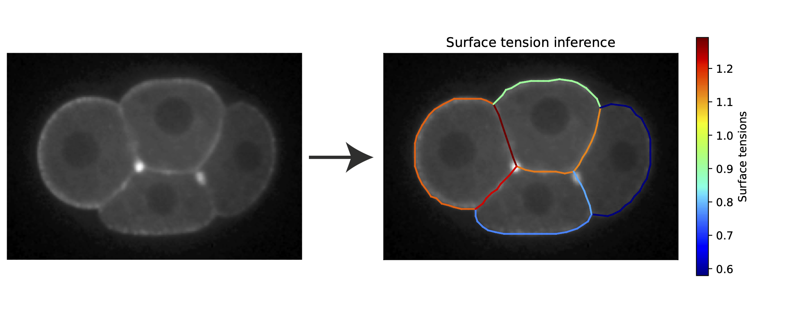

### foambryo-2d

**foambryo-2d** is a python package based on Polyscope designed to infer surface tensions in 2D epithelial-cell-clusters `pip install foambryo-2d` It is the lightweight 2D adaptation of the 3d force-inference software [foambryo](todo), available soon.

We rely on [delaunay-watershed](https://github.com/VirtualEmbryo/delaunay_watershed_2d), a tool we designed to reconstruct efficiently multimaterial meshes from instance segmentations. From these multimaterial meshes, we can efficiently and robustly extract junctional angles and invert **Young-Dupré** laws, to find back the physical parameters involved in the mechanical equilibrium: **surface tensions** $\gamma_{ij}$.

### Example 

Load an instance segmentation, reconstruct its multimaterial mesh, infer and visualize the forces 




```shell
pip install foambryo-2d
```

```py
from dw2d import geometry_reconstruction_2d
from foambryo2d import infer_tension,plot_tension_inference

## Load the labels
import skimage.io as io
Segmentation = io.imread("Segmentation.tif")

## Reconstruct a multimaterial mesh from the labels
DW = geometry_reconstruction_2d(label, min_dist=3)
Mesh = DW.return_dcel()

## Infer and view the forces
_,dict_tensions,_ = infer_tension(Mesh,mean_tension=1,check_topo_changes=False,mode='YD')
plot_tension_inference(Mesh,dict_tensions)
```

### Installation

`pip install foambryo2d`


### API and Documentation

#### 1 - Creating a Mesh object
The first step is to load your multimaterial mesh into a `DCEL_Data` object via the builder `DCEL_Data(Verts, Edges_multimaterial)`:
- `Verts` is an V x 2 numpy array of vertex positions
- `Edges_multimaterial` is an F x 4 numpy array of face and material indices, where at each row the 2 first indices refers to a vertex and the 2 last refer to a given material, 0 being the exterior media

#### 2 - Infer the forces
 Then the second step is to use this `Mesh` object to infer the tensions and pressions
- `infer_tension(Mesh,mean_tension=1,mode='YD')`: 
We infer tensions ratios by inverting junctional equilibrium relations
    - `Mesh` is a `DCEL_Data` object
    - `mean_tension` has to be defined as we only infer ratio between tensions
    - `check-topo-changes` checks if a mechanical equilibrium can be attained or if the resulting configuration will lead to a topology change
    - `mode` is the formula used to infer the tensions. It has to be choosen among: `YD`, `Eq`, `Projection_YD`,  `cotan`, `inv_cotan`, `Lamy`, `inv_Lamy`, `Lamy_Log`, `Variational`

#### 3 - Visualize

- `plot_tension_inference(Mesh,dict_tensions=None,original_image = None,plot_original_image = False)
    - `Mesh` is a `DCEL_Data` object
    - `dict_tensions` is the dictionnary obtained with `infer_tension`, and is computed automatically if unspecified. 
    - `original_image`: the original image is plotted if provided

---


### Credits, contact, citations
If you use this tool, please cite the associated preprint.
Do not hesitate to contact Sacha Ichbiah and Hervé Turlier for practical questions and applications. 
We hope that **foambryo2d** could help biologists and physicists to shed light on the mechanical aspects of early development.

```
@article {Yamamoto2023.03.07.531437,
	author = {Yamamoto, Kazunori and Ichbiah, Sacha and Pinto, Joana and Delbary, Fabrice and Goehring, Nathan and Turlier, Herv{\'e} and Charras, Guillaume},
	title = {Dissecting the subcellular forces sculpting early C. elegans embryos},
	elocation-id = {2023.03.07.531437},
	year = {2023},
	doi = {10.1101/2023.03.07.531437},
	publisher = {Cold Spring Harbor Laboratory},
	abstract = {Embryo shape is governed by the mechanics of individual cells, the strength of intercellular interactions, and geometrical constraints. Models in which cells interact through surface tensions successfully predict cell arrangement within aggregates. However, predicting cell shape dynamics remains challenging because of difficulties in measuring temporal changes in tensions. Here, we dissect the spatiotemporal changes in cellular surface tensions that sculpt the early nematode embryo, using AFM measurements and inverse modeling. We validate a hybrid tension inference pipeline that combines dynamic information from cell geometry and cortical myosin enrichment. The inferred spatiotemporal tensions allow prediction of morphogenesis in wild-type embryos as well as phenotypic changes arising from protein depletion. We further uncover a direct and non-affine contribution of cadherins to cell contact tensions, whose magnitude is comparable to cadherins{\textquoteright} indirect contribution via actomyosin regulation. Overall, our inference pipeline allows characterization of the forces underlying morphogenesis and their relationship to molecular processes.Competing Interest StatementThe authors have declared no competing interest.},
	URL = {https://www.biorxiv.org/content/early/2023/03/09/2023.03.07.531437},
	eprint = {https://www.biorxiv.org/content/early/2023/03/09/2023.03.07.531437.full.pdf},
	journal = {bioRxiv}
}
```

### License

Shield: [![CC BY-NC-SA 4.0][cc-by-nc-sa-shield]][cc-by-nc-sa]

This work is licensed under a
[Creative Commons Attribution-NonCommercial-ShareAlike 4.0 International License][cc-by-nc-sa].

[![CC BY-NC-SA 4.0][cc-by-nc-sa-image]][cc-by-nc-sa]

[cc-by-nc-sa]: http://creativecommons.org/licenses/by-nc-sa/4.0/
[cc-by-nc-sa-image]: https://licensebuttons.net/l/by-nc-sa/4.0/88x31.png
[cc-by-nc-sa-shield]: https://img.shields.io/badge/License-CC%20BY--NC--SA%204.0-lightgrey.svg
